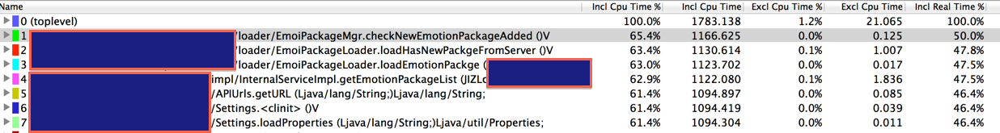

 ---
 title: analysis android app CPU usage with traceview  
 author: wuche  
 layout: post  
 permalink:  /android-traceview/  
tags:   
 -  android
 -  traceview

---  
测试设备：  
- 三星SCH-I699I  
- android 4.0.4  
- cpu 单核 1GHZ  
- 内存 512M  

<!--more-->  
打点方法：  
在Activity onCreate()方法中打点
Debug.startMethodTracing("zhaduiTest”);  
在onDestroy中打点  
Debug.stopMethodTracing();  
本地编译代码到测试机上。  

测试场景：  
正常玩功能，10分钟。

测试结果：  
空跑设备，系统cpu利用率5%左右  
玩功能，系统cpu利用率70%左右  
测试场景的cpu消耗在65%左右

从手机sdcard中下载xxxxx.trace文件到本地：adb pull /sdcard/xxxxx.trace,本地运行traceview xxxx.trace。打开trace界面。  
图1：测试场景的方法，消耗cpu在65%左右。 
  

两个可优化的地方  
1.EmoilPackageMgr.checkNewEmotionPackageAdded()方法  
2.java 并发锁   
  
逐步分析方法的调用，对业务代码来说，最底层的调用是Settings.loadProperties方法。cpu消耗61.4% ，再往下走，就是调用java的classload，getResourceAsStream方法了。  
  
对java并发锁来说，消耗cpu 30%，其中自身消耗cpu 11.1%，重复调用的次数：1834次。  
这个java并发锁，消耗系统的cpu30%左右，有点高。需要重点排查下原因。    

附录:traceview 图表的名词解析  
- Exclusive: 同级函数本身运行的时间  
- Inclusive 就是说除统计函数本身运行的时间外再加上调用子函数所运行的时间
- Name：列出的是所有的调用项，前面的数字是编号，展开可以看到有的有Parent 和Children子项，就是指被调用和调用。 
- Incl: inclusive时间占总时间的白分比  
- Excl: 执行占总时间的白分比  
- Calls+Recur Calls/Total: 调用和重复调用的次数  
- Time/Call: 总的时间。(ms)  
