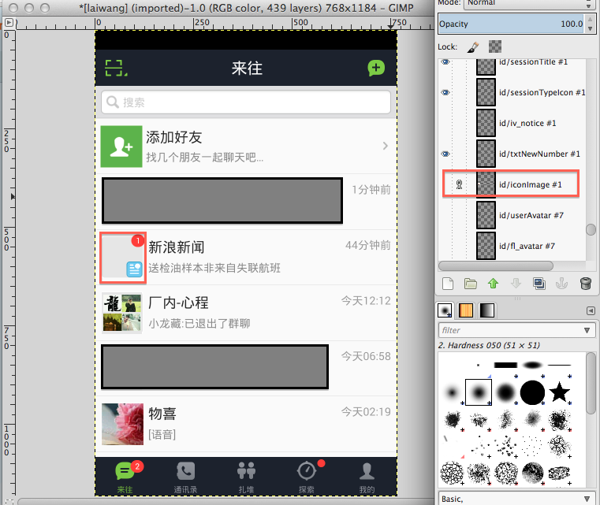

---  
title: 一个移动app的layout性能分析  
author: wuche  
layout: post  
permalink:  /android-layout/  
tags:   
 -  android
 -  layout  

---  
经常有用户反馈某app卡顿，页面打开慢，这其中除了网络的因素外，布局也是很重要的一个因素。这次对来往的layout进行了性能分析。  
<!--more-->  
测试设备：  
- nuxus4  
- android 4.2.2  
- cpu 高通 1536MHz 四核  
- 内存8G 

测试过程：  
打开nexus4手机 settings---developer options----show GPU overdraw。  
Show GPU overdraw 使用不用的颜色来绘制屏幕，来指示过度绘制在哪里发生以及程度如何。
没有颜色意味着没有透支。像素只画了一次。在这个例子中，你可以看到背景颜色没有变化。  
- 蓝色 意味着透支1倍。像素绘制了两次。大片的蓝色还是可以接受的。   (如果整个窗口是蓝色的，你可以摆脱一层。)  
- 绿色 意味着透支2倍。像素绘制了三次。中等大小的绿色区域是可以接受的但你也应该尝试优化，减少他们。  
- 浅红 意味着透支3倍。像素绘制了四次。小范围内可以接受。  
- 暗红 意味着透支4倍。像素绘制了五次或者更多。这是错误的，要修复他们。  
来往的首页如图1：  
  
从图中可以看出，暗红色的区域非常多，说明这些区域透支严重，存在过度绘制的情况，有很大的性能优化空间。
如何更加进一步定位这些透支和过度绘制呢？  
hierarchyviewer 是个好工具，可惜不能对真机使用，可以对模拟器使用。运行来往app到模拟器，打开一个终端运行：hierarchyviewer，出现hierarchyviewer的树状图。

选中图中一个layout点击“display layout”可以详细看到这个layout。其实这样看layout还是不能定位到底过度绘制在哪里？继续深入分析。  
用hierarchyviewer dump整个layout层次图，dump出来的文件，可以用photoshop等工具打开。用photoshop打开后，可以清晰的看到每一层的布局。点击“眼睛”可以决定是否显示该layout。  
  
去掉id/header可见，可以看到这个layout的底部不是透明的。存在过度绘制现象，而且这种现象在整个来往页面上大量存在。所以出现卡顿，页面打开慢，就不奇怪了。  
效果图如下：  
  
再测试一下头像。去掉图像layout可见。可以看到头像的底部也不是透明的。  
 

这个问题的简单解决方法是把9-patch中间部分设置为透明。 Android的 2D渲染器总是把9-patch优化为透明。这个简单的改变将会去掉很多的过度绘制。

参考文档：  
http://www.curious-creature.org/2012/12/01/android-performance-case-study/  
http://www.oschina.net/translate/android-performance-case-study

 
