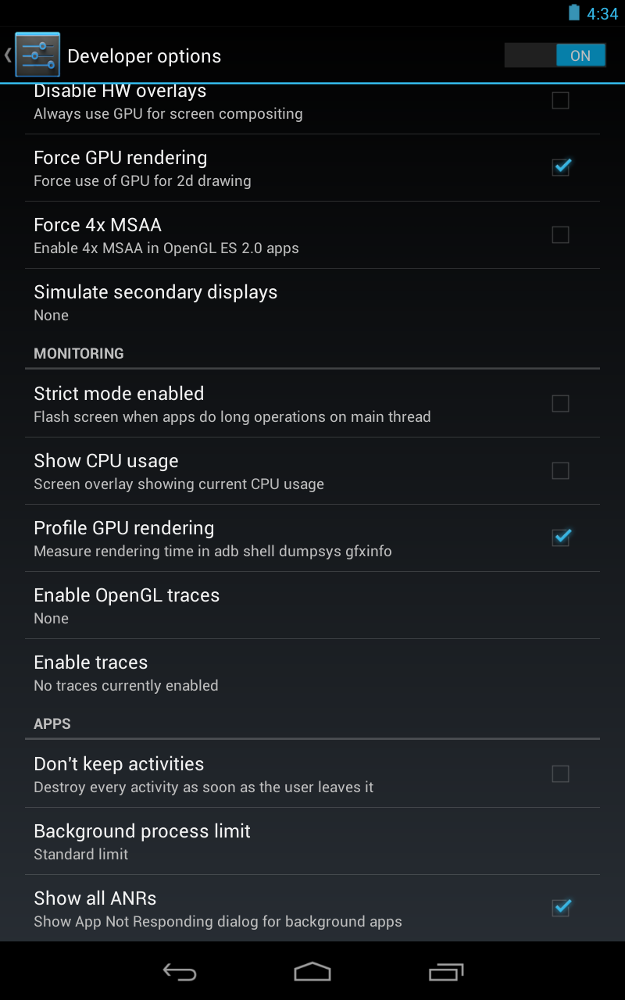
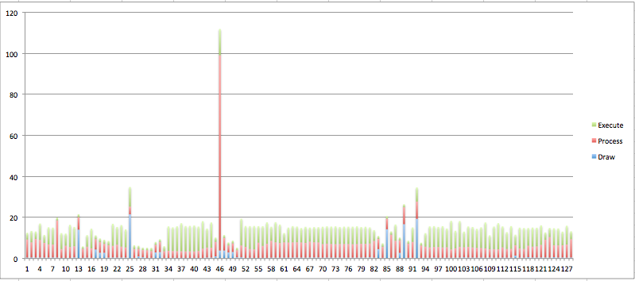

---
title: android获取FPS的方法 
author: wuche  
layout: post  
permalink:  /android-fps/  
tags:  
  - android  
  - fps
  
---    
android app 在运行过程中，经常会让人感觉有“卡顿”现象。从性能角度来说，“卡顿”现象的存在，可能是每帧的耗时太长或者丢帧导致的。所以需要对app的帧率进行性能分析。  
第一步，获取app的帧率，看看帧率是否满足性能需求。  
<!--more-->
#测试设备：  
nuxus4  
android 4.2.2  
cpu 高通 1536MHz 四核  
内存8G  

#测试过程：  
1. 打开nuxus4手机，setting--developer options --Profile GPU rendering  
  

2. 打开app，对待测的场景进行滑动。
3. 结束后，在终端输入：$ adb shell dumpsys gfxinfo com.xxx.xxxx，在终端显示的日志中，找到Profile data in ms:,下面有activity名和3列数据。复制这3列数据到excel上，产生一个堆叠柱状图表。  
部分原始日志如下：  

	com.xxxx.xxx.xxx/com.xxx.xxx.xxx.biz.MainTabActivity/android.view.ViewRootImpl@439b0510  
	Draw	Process	Execute  
	0.49	8.79	3.27  
	0.55	7.36	5.52  
	0.49	9.10	3.57  
	0.49	8.58	7.97  
	0.49	7.14	3.85  
	0.49	6.38	8.33  
	0.52	6.29	8.24  
	0.49	18.10	1.40  
	0.34	4.27	7.75  
	0.34	5.95	5.86  
	0.34	5.28	10.80  
	0.55	5.46	9.37  
	14.07	6.10	1.40  
	0.37	4.33	1.22  
	0.46	5.34	5.59  
  
每列给出渲染每帧大概需要多长时间:  
- Draw是消耗在构建java显示列表的时间。   它显示出运行方法用的时间诸如View.onDraw(Canvas).  
- Process是消耗在Android的2D渲染器执行显示列表的时间。你的视图层次越多，要执行的绘图命令就越多。  
- Execute是消耗在排列每个发送过来的帧的顺序的时间.这部分的图通常是很小的。   
为了顺利在60帧，没帧的时间要小于16毫秒。  
通过图表，大部分的帧的时间在16ms左右，有几帧的时间非常大。可能出现卡顿或者丢帧的情况。  
