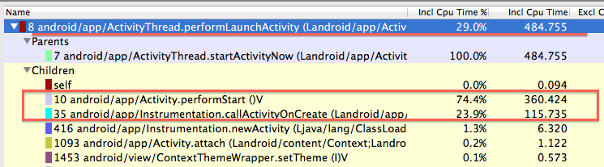

---
title: traceview 分析cpu时间  
author: wuche  
layout: post  
permalink:  /traceview-cputime/  
tags:  
  - android 
  - traceview
  
  
---    

好几天没写blog，这个习惯还是要坚持，正确每周至少整理一篇吧，把本周做的事，一些心得写出来。最近加入性能优化scrum小组，其实对我来说差不多，我一直在做性能优化的事，还是那句话，做自己擅长的事，发现性能问题，定位性能问题，尽可能提供解决方案，推动业务开发同学随着版本的迭代优化，在解决产品性能问题的同时，提高自己。或许这是我对自己的定位吧。很高兴，以前一直从事性能测试工作，测试工作的经历，让我更加敏锐的发现问题，更加准确、详细的定位问题。开发，测试，都不重要。重要的是自己承担产品的那一份心。有点扯远了。因为最近老有同事问我，现在不是测试了，为啥还做测试的工作，因为不测试，我拿不到数据，怎么做性能优化？性能优化不是高大上，也不是高精尖，从拿到测试，定位性能问题开始吧。  
<!--more-->  
今天继续写一篇关于traceview的文章。traceview是个好工具，能清晰的分析cpu利用率和消耗的时间，可惜以前用的不多，也没怎么深入去研究过。最近对这些android的性能优化工具，都会好好的研究一把。在实际解决问题中发挥作用。 
1. traceview 分为2个区域，timeline 和 profile。timeline区域中可以看到每个线程在每个时间点的运行情况。[1]main就是android的主线程，今天重点分析这个线程。通过图1，看到主线程耗时在1800~1900ms之间。  
 
2. 鼠标放上去，可以看到主线程在每个时间点的操作。通过图，我们可以看到，我这次操作的主线程执行，非常碎片化，很难定位到具体的原因。有的操作，如果占了主线程很长的时间，那可以轻松定位到性能瓶颈。  
3.  换一种方式，从方法profile中去查看cpu的消耗时间。点击“0(toplevel)”可以看到方法消耗的cpu百分比和cpu时间。

4. 但是这些方法，不一定全是主线程，也有可能是其他线程。点击其中一个方法，timeline区域中会显示一个”中括号“，表示这个方法在哪个线程哪段时间的消耗。如图,可以看到这个方法是在主线程中180ms~1100ms之间，耗时491ms。  

5. 继续细化这个方法，可以看到这个方法的耗时主要集中在2个部分,这2部分，还可以继续深入定位。   

6. performStart()的360ms主要花费在这3个方法。

7. loadData分为2部分，从server获取数据和从cache重获取数据。分别消耗160ms左右。看看这里有没有优化的空间。

8. layout inflate 和draw消耗120ms左右，现在的UI设计性能是有点差，这个可以通过对UI的重新布局，可以优化。

