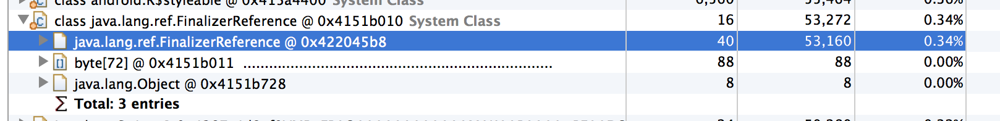

---
title: finalize 引起内存泄露  
author: wuche  
layout: post  
permalink:  /android-finalize/  
tags:  
  - Android 
  - finalize
  
  
---  
大脑和内存一样，需要定时清理。老把知识记在大脑里，一直牵挂着，时间久了，也容易忘记。还不如写进“硬盘”，释放大脑的容量。  
最近在做Android app内存方面的性能优化，这篇文章记录下finalize引起内存泄露的案例。

<!--more-->  
MAT（memory analysis tools）是一个分析Android 内存使用的利器。要做好性能优化，首先要对各种性能分析工具非常了解。善用这些工具，可以帮忙你快速、准确的定位性能瓶颈。  
通过对某app首屏内存dump，发现java.lang.res.FinalizerReference占了121KB左右的内存。这个是可以被优化。
  

finalizerReference是由代码中的object用到了finalize方法引起的，为啥finalize会引起内存泄露呢？详细请看staticoverflow的解释。http://stackoverflow.com/questions/8355064/is-memory-leak-why-java-lang-ref-finalizer-eat-so-much-memory  
根据这个线索，去查业务代码的哪里引用了finalize方法。发现某个类中，实现了这个方法。

	@Override
	protected void finalize() throws Throwable {
		try {
			recycle();
		} finally {
			super.finalize();
		}
	}   
而这个类，被很多对象引用。注释这段代码，重新dump内存，发现java.lang.res.FinalizerReference retained 的内存下降到53KB。   
   
