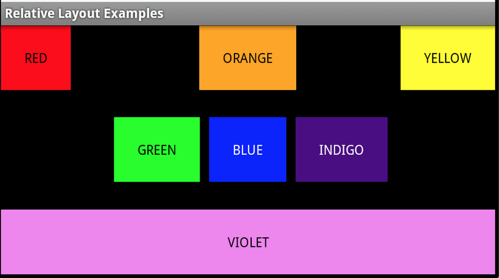

---
title: RelativeLayout Demo   
author: wuche  
layout: post  
permalink:  /android-relativeLayout/  
tags:  
  - Android 
  - relativeLayout
  
  
---  
relativeLayout的性能要比linearLayout好。如果有时间，可以把所有LinearLayout改为RelativeLayout。看到一个很好的相对布局的demo，动手写了一遍。  
```xml  

<?xml version="1.0" encoding="utf-8"?>
<RelativeLayout xmlns:android="http://schemas.android.com/apk/res/android"
    android:layout_width="fill_parent"
    android:layout_height="fill_parent" >
    <TextView
        android:text="RED"
        android:id="@+id/TextView01"
        android:layout_height="wrap_content" 
        android:background="#f00"
        android:gravity="center"
        android:textColor="#000"
        android:layout_width="wrap_content"
        android:padding="25dp"></TextView>
    <TextView 
        android:text="ORANGE"
        android:layout_height="wrap_content"
        android:background="#ffa500"
        android:gravity="center"
        android:textColor="#000"
        android:id="@+id/TextView02"
        android:layout_width="wrap_content"
        android:layout_centerHorizontal="true"
        android:padding="25dp"/>
    <TextView 
        android:text="YELLOW"
        android:layout_height="wrap_content"
        android:layout_width="wrap_content"
        android:background="#ffff00"
        android:gravity="center"
        android:textColor="#000"
        android:layout_alignParentRight="true"
        android:padding="25dp"/>
    <TextView 
        android:text="GREEN"
        android:layout_height="wrap_content"
        android:layout_width="wrap_content"
        android:gravity="center"
        android:background="#0f0"
        android:textColor="#000"
        android:id="@+id/TextView04"
        android:layout_toLeftOf="@+id/TextView05"
        android:padding="25dp"
        android:layout_centerVertical="true"/>
    <TextView 
        android:text="BLUE"
        android:layout_height="wrap_content"
        android:layout_width="wrap_content"
        android:gravity="center"
        android:id="@+id/TextView05"
        android:textColor="#fff"
        android:background="#0ff"
        android:layout_centerInParent="true"
        android:layout_margin="10dp"
        android:padding="25dp" />
        <TextView
        android:text="INDIGO"
        android:layout_height="wrap_content"
        android:gravity="center"
        android:textColor="#fff"
        android:id="@+id/TextView06"
        android:layout_width="wrap_content"
        android:layout_toRightOf="@+id/TextView05"
        android:background="#4b0082"
        android:padding="25dp"
        android:layout_centerVertical="true"></TextView>
    <TextView
        android:text="VIOLET"
        android:layout_height="wrap_content"
        android:background="#ee82ee"
        android:gravity="center"
        android:textColor="#000"
        android:id="@+id/TextView07"
        android:layout_alignParentBottom="true"
        android:layout_width="fill_parent"
        android:padding="25dp"></TextView>
    
</RelativeLayout>  
```  
出来的效果如图  
  
这个布局用到了中间线的水平，垂直对齐，还有padding，margin参数。 

