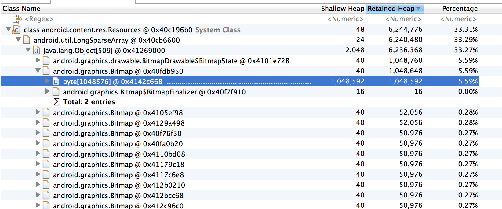
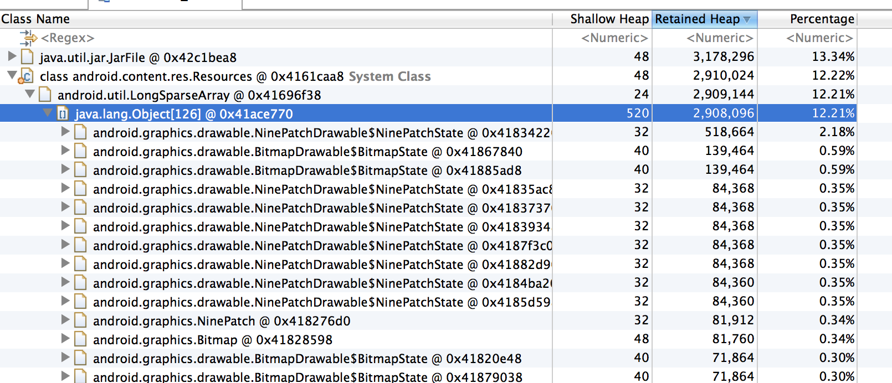

---
title: 三星手机内存多2张系统背景图  
author: wuche  
layout: post  
permalink:  /memory-analysis-sansumg/  
tags:  
  - sansumg
  - memory
  
  
---  

三星手机，dump内存，发现会有2张占内存1MB左右的系统背景图，很坑爹，具体原因现在还不知道。  
图1：  
 
小米手机，同样的app，dump内存，发现没有这2张系统背景图。难道是小米系统优化了么？我觉得这个应该是可以从app层面来优化掉。  
图2：  
  

