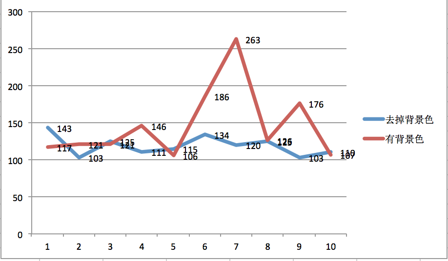
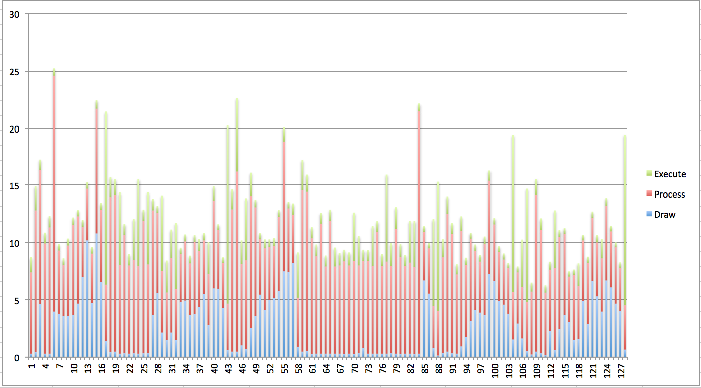
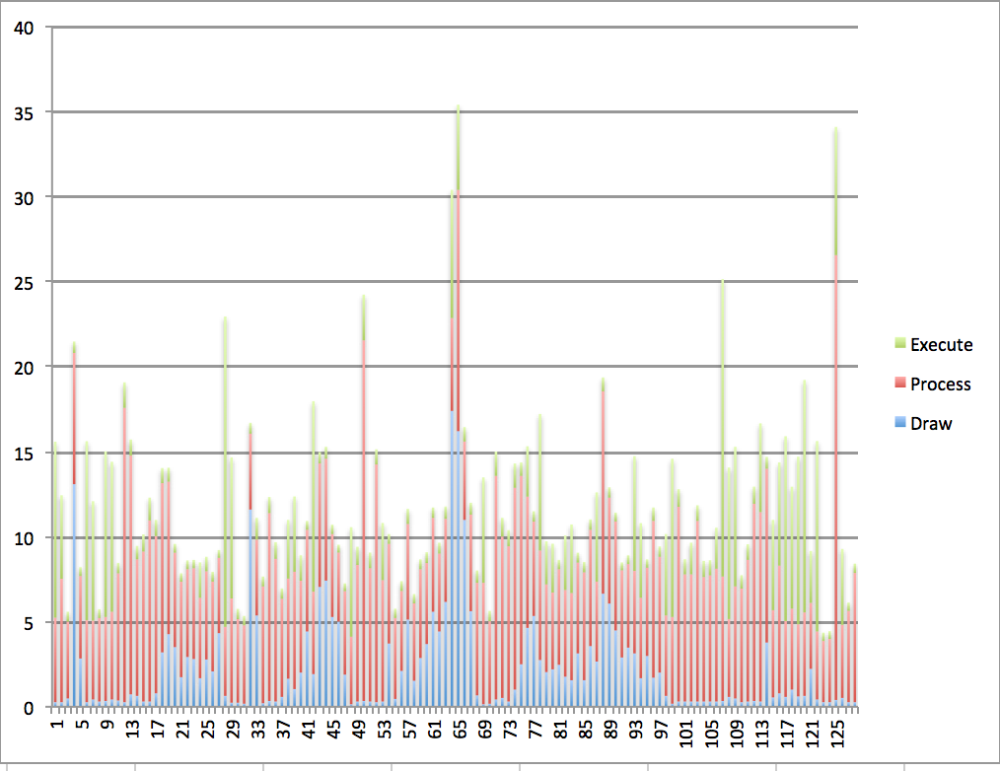

---
title: 过度绘制对启动时间的影响  
author: wuche  
layout: post  
permalink:  /Android-activity-startTime/  
tags:  
  - Android  
  - UI  
  
  
---  
##前言  
在客户端性能优化中，经常遇到“过度绘制”这个概念。Android4.3后，打开“开发者选项-调试GPU过度绘制-显示过度绘制区域”，可以看到应用的过度绘制区域。  
蓝色 1x过度绘制   
绿色 2x过度绘制   
淡红色 3x过度绘制   
红色 超过4x过度绘制   
我们知道过度绘制，对性能，对FPS有影响，但是究竟影响有多大呢？简单的做一次实验，用数据来说明。

##测试机型 

小米2S（中型机）  
Android 4.1.1  
4核1.7GHZ   
内存 2GB  

##测试场景  
Activity有背景色，整体过度绘制如图1： 
  
Activity没有背景色，整体过度绘制如图2:    
  

进入和退出这个页面10次，统计这个页面的launch time。图3：  
    

去掉背景色的启动时间平均值是118ms，有背景色的启动时间平均值是146ms，有背景色的启动时间比没有背景色的启动时间多28ms，慢23%   
再看下FPS的对比效果。去掉背景色的FPS如图4：丢帧14帧左右。 

有背景色的FPS如图5：丢帧15帧左右。
  
##结论  
虽然不同的机型，可能数据不同，但是通过本次实验，可以得到一些结论。   
1.一屏背景色的过度绘制，影响Activity的启动时间在23%左右。  
2. 整屏背景色的过度绘制，对activity的FPS丢帧率影响不大。
